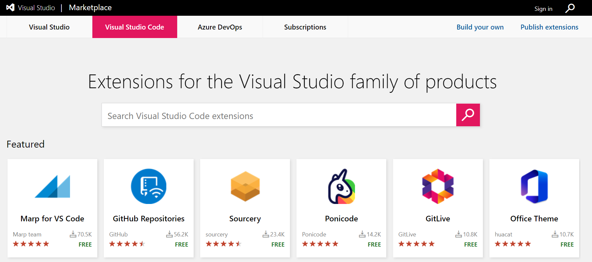
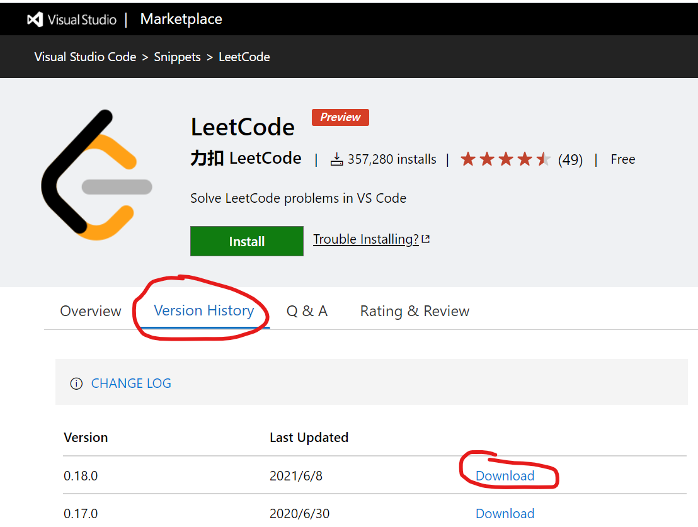
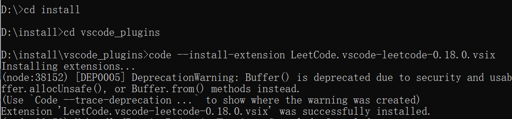

<!--
 * @Author: 张国欣
 * @Description: vscode插件安装
 * @Date: 2021-09-01 11:01:04
 * @LastEditors: Please set LastEditors
 * @LastEditTime: 2021-09-01 15:17:15
-->
## vscode无网络的插件安装
#### 在某些网络管控比较严格的公司电脑是无法访问公网的，但是为提升工作效率又需要给vscode安装插件，这种情况下使用vscode自带的插件安装功能就不行了，需要按如下步骤进行插件安装。
1. 插件进入插件市场 [https://marketplace.visualstudio.com/](https://marketplace.visualstudio.com/)

2. 下载插件

3. 安装插件
  3.1 将插件文件拷贝到特定位置如 D:\install\vscode_plugins
  3.2 使用命令行按钮
```js
code --install-extension 插件名.vsix
```


